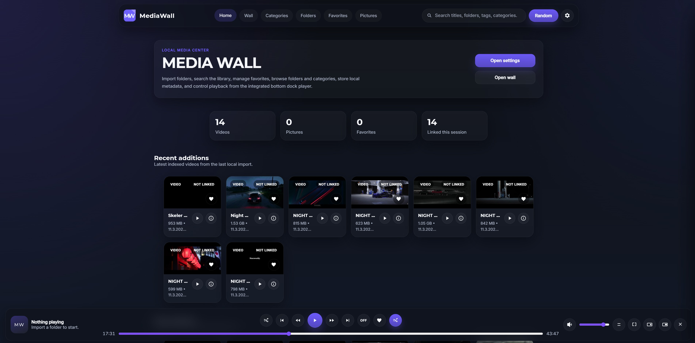
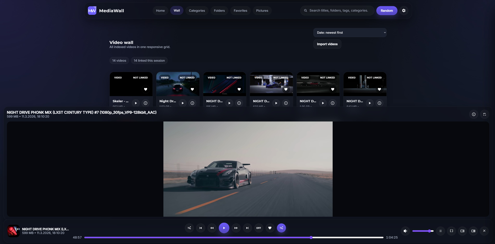

# MediaWall Player

MediaWall is a local-first media wall for videos and pictures that runs directly in a web browser.

It is built as a lightweight HTML, CSS, and JavaScript project with a dark interface, a centered browsing experience, and a bottom dock player inspired by media center layouts. The main goal is simple: open `index.html`, import your local media folders, and browse your content without needing a PHP server or a more complex backend setup.

## Disclaimer
MediaWall is currently a work in progress and should be considered an early proof of concept rather than a stable release. The project is still relatively unstable, performance is not yet optimized, and several planned features are still missing. Some existing functions are only partially implemented or may not work reliably in all cases. It is currently intended for testing, evaluation, and further development, not for production use.

## What it does

MediaWall lets you build a small local media library inside the browser. It can index videos and pictures from folders you import, display them in a clean grid layout, store metadata locally, and export or import the local database as JSON.

The application is designed for local use and quick access. It is especially useful if you want a simple media wall prototype, a local browser-based media launcher, or a foundation for a larger media project.

## Main features

- Direct browser start via `index.html`
- No PHP server required
- Dark UI with a configurable accent color
- Sections for Home, Wall, Folders, Favorites, and Pictures
- Integrated search bar
- Bottom dock video player
- Player controls for play, pause, seek, mute, volume, fullscreen, theater mode, picture-in-picture, collapse, expand, and close
- Prominent random playback button
- Favorites support for videos and pictures
- Detail view with editable tags, categories, and description
- Thumbnail cache using IndexedDB
- Local mini database stored in the browser
- JSON export and import for settings and metadata
- Responsive layout for desktop and mobile use

## Previews






## Project structure

```text
MediaWall/
├── index.html
└── assets/
    ├── media/
    ├── fonts/
    ├── css/
    │   └── styles.css
    └── js/
        ├── app.js
        ├── config.js
        └── storage.js
```

## How to use it

### 1. Open the project
Unpack the ZIP file and open `index.html` directly in your browser.

### 2. Import your media
Use the settings area or the available import actions to load your local video folder and picture folder.

### 3. Browse your library
Use the top navigation to switch between:

- **Home** for highlights and quick access
- **Wall** for all indexed videos
- **Folders** for a folder-based view
- **Favorites** for starred content
- **Pictures** for image browsing

### 4. Play media
Select a video from the wall. Playback opens in the integrated bottom dock player, so you can continue browsing while the video keeps running.

### 5. Save and restore your local database
Export your local JSON database if you want to keep a backup of your metadata, favorites, and settings. Import it later to restore your setup.

## Important limitation

MediaWall runs without a backend, which keeps it simple, but this also means the browser controls access to local files.

Because of that:

- settings, favorites, metadata, playback progress, and cached thumbnails can stay available locally in the browser
- imported media file access may need to be granted again in a later session, depending on the browser and how the files were loaded


## Notes

- The project is meant for local usage and prototyping.
- It is not a full media server.
- It does not include a real backend database.
- It is best suited as a lightweight standalone media wall or as a base for future expansion.


