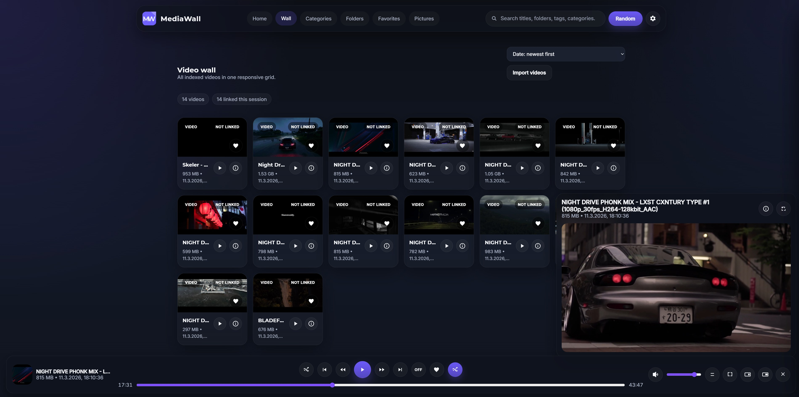
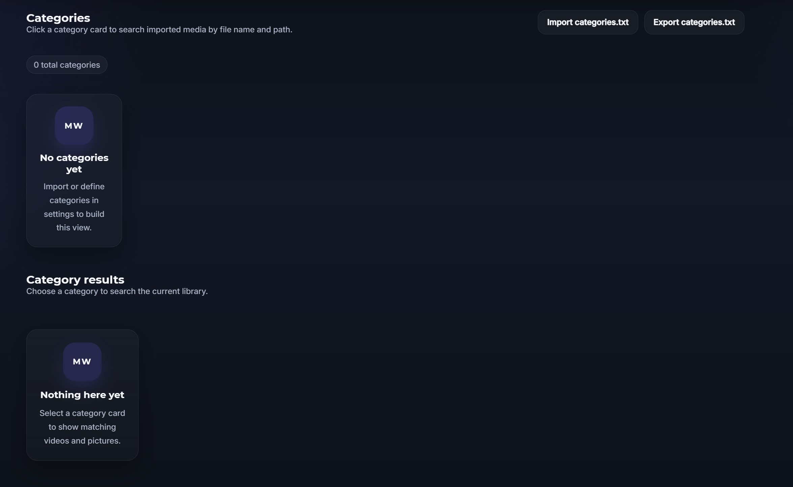
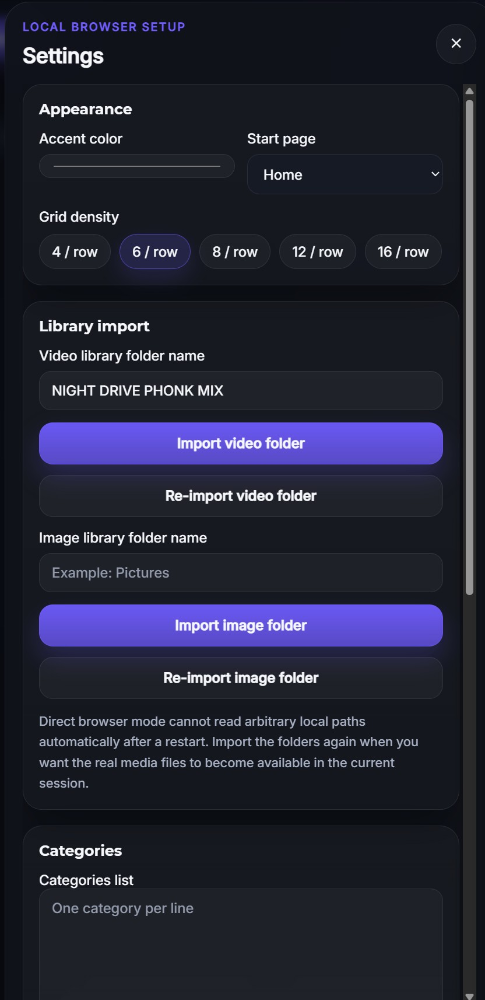

# MediaWall SERVER

MediaWall SERVER is a server-based media browser with a fixed library path, PHP login sessions, a Python scan engine, and FFmpeg/FFprobe support for thumbnails and metadata.

## Stack

- PHP: web app, API, login, config
- Python: scan engine, ffprobe, thumbnail cache builder
- FFmpeg / FFprobe: media tooling

## Main features

- Direct browser start via `index.html`
- No PHP server required
- Dark UI with a configurable accent color
- Sections for Home, Wall, Folders, Favorites, and Pictures
- Integrated search bar
- Bottom dock video player
- Player controls for play, pause, seek, mute, volume, fullscreen, theater mode, picture-in-picture, collapse, expand, and close
- Prominent random playback button
- Favorites support for videos and pictures
- Detail view with editable tags, categories, and description
- Thumbnail cache using IndexedDB
- Local mini database stored in the browser
- JSON export and import for settings and metadata
- Responsive layout for desktop and mobile use

## Previews







## Folder layout

- `index.php`
- `api/`
- `python/`
- `assets/`
- `data/`

## Setup

1. Extract the project into the document root of a PHP-enabled virtual host.
2. Copy `api/config.example.php` to `api/config.php`.
3. Edit:
   - `library_root`
   - `ffmpeg_path`
   - `ffprobe_path`
   - `python_path`
   - `admin_username`
   - `admin_password_hash`
4. Make sure PHP can write to `data/`.
5. Open the site and sign in.

## Password hash

Generate a new password hash with PHP:

```bash
php -r "echo password_hash('YOUR_PASSWORD', PASSWORD_DEFAULT) . PHP_EOL;"
```

## Notes

- Use HTTPS.
- Restrict `data/` with the web server.
- Change the default admin password before public use.
- This project is a work in progress and provided as-is.

### complicatiion aka sksdesign · 2026


